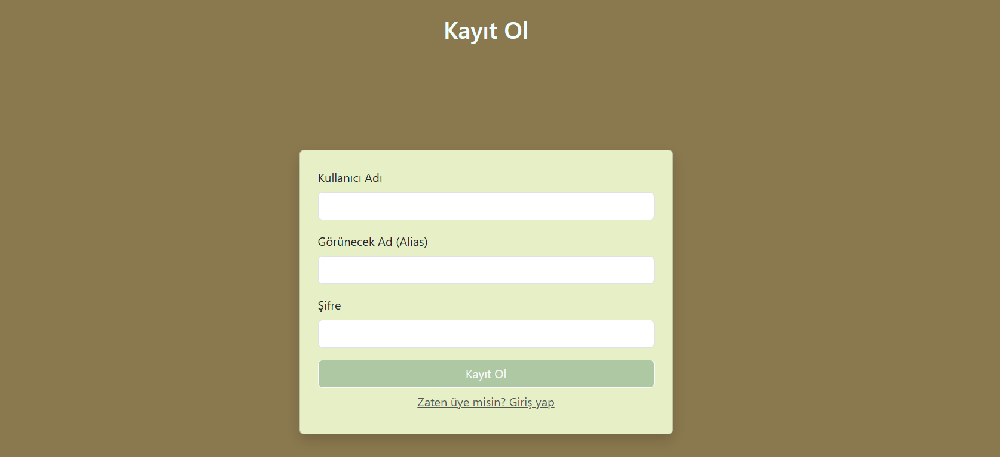
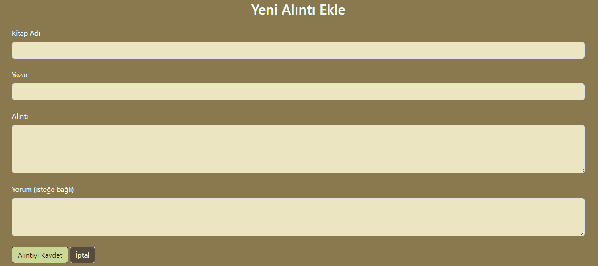
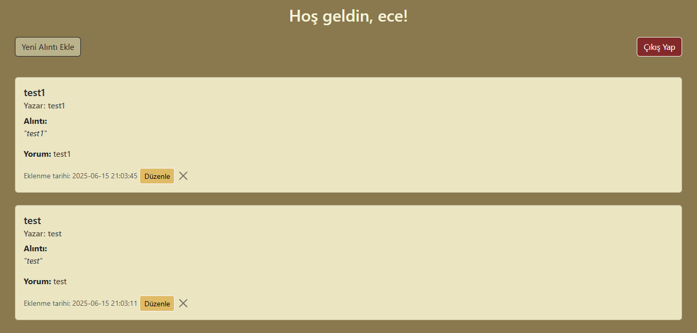
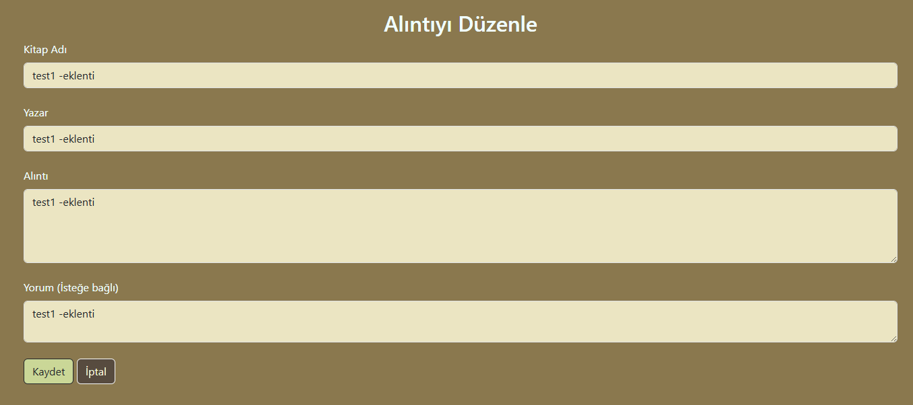
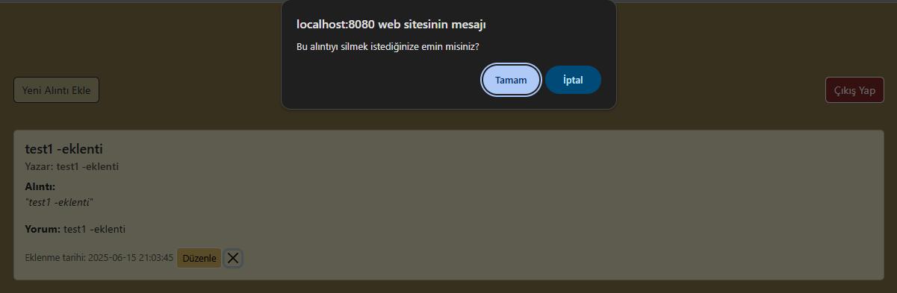

# 📚 Kitap Alıntıları Uygulaması

Bu web uygulaması, kullanıcıların okudukları kitaplardan alıntılar ekleyip isterlerse kendi yorumlarını yazabildiği basit bir sistemdir. Kullanıcılar kayıt olabilir, giriş yapabilir ve alıntılarını yönetebilir.

## 🚀 Özellikler

- 👤 Kullanıcı Kaydı ve Girişi

- 📝 Alıntı Ekleme (Kitap adı, yazar, alıntı ve yorum)

- 📋 Alıntıları Listeleme (Giriş yapan kullanıcıya özel)

- ✏️ Alıntıları Düzenleme

- 🗑️ Alıntı Silme

---

## 🛠️ Locahost'ta Çalıştırmak için:

1. **XAMPP** yerel sunucusunu kurun.
2. `kitap_alintilari` klasörünü `\xampp\htdocs` klasörü içine yerleştirin.
3. xampp kontrol panelinde Apache ve MYSQL başlatın.
4. Tarayıcı üzerinden localhost'ta `kitap_alintilari` adlı veritabanı oluşturun.
    - Veritabanı içine `kitap_alintilari.sql` dosyasındaki CREATE TABLE komutlarıyla tabloları oluşturun.
5. localhost/kitap_alintilari/register.php adresinden siteye erişim sağlayabilirsiniz.

---
[YouTube uygulama videosunu izlemek için tıklayın.](https://youtu.be/UsPw3P8S-g8)

